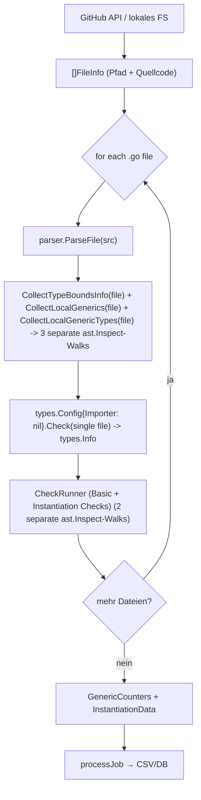
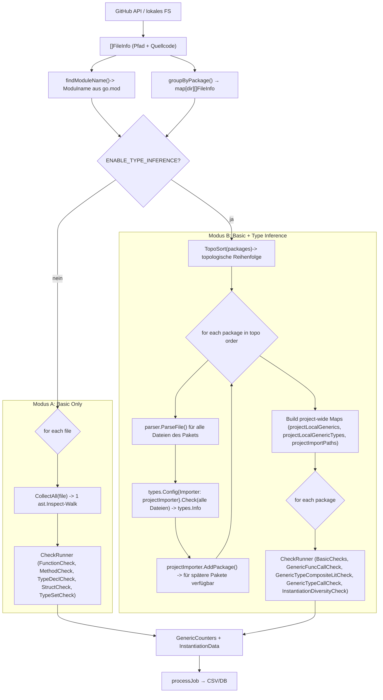

# Erweiterung 5 – Analyse-Bericht: Instantiierungserkennung & Performance

## 1. Architektur: Vorher vs. Nachher

### 1.1 Alter Flow (Single-File)



**Probleme:**

- `types.Check` wird **N_files-mal** aufgerufen (einmal pro `.go`-Datei)
- `Importer: nil` → keine Cross-File-Auflösung → Instantiierungen über Dateigrenzen werden als extern eingestuft und **nicht gezählt**
- 3 separate `ast.Inspect`-Walks pro Datei für die Collector-Phase + 2 `ast.Inspect`-Walks für die CheckRunners (einmal basic checks und einmal type/instantiation checks)

### 1.2 Neuer Flow (Project-wide)



---

## 2. Erweiterung 5

| Counter | Bedeutung |
| --- | --- |
| `GenericMethodInstantiationInferred` | Aufruf einer Methode auf einem generischen Receiver-Typ, wobei der Typ-Parameter aus dem Receiver inferiert wird |

### Warum `GenericMethodInstantiationExplicit` nicht verwendet wird

In Go ist es **syntaktisch nicht möglich**, Typ-Argumente bei einem Methodenaufruf explizit anzugeben. Die Syntax `x.m[int]()` ist kein gültiges Go.

Typ-Argumente bei Methoden werden **immer** aus dem Receiver-Typ inferiert. Wenn `x` vom Typ `S[int]` ist, dann ist bei `x.m()` der Typ-Parameter `A = int` bereits durch den Receiver festgelegt.

```go
type S[A any] struct{ val A }
func (x S[A]) m() A { return x.val }

x := S[int]{val: 42}
x.m()        // gültig
x.m[int]()   // Compile-Fehler 
```

## 3. Der Bottleneck: N_files × types.Check

### Warum ist `types.Check` teuer?

In Go sind Syntax und Semantik **strikt getrennt**:

| Schicht | Paket | Inhalt |
| --- | --- | --- |
| Syntax | `go/ast` | Ungetypter AST – reine Baumstruktur, kein Typ-Wissen |
| Semantik | `go/types` | Typ-Informationen als separate Side-Table (`types.Info`) |

Ein `*ast.Ident`-Node weiß nichts über seinen Typ. Um zu wissen, ob `x` in `x.m()` ein `S[int]` ist, muss `types.Config.Check()` aufgerufen werden – ein vollständiger, separater Analyse-Pass, der:

1. alle Bezeichner auflöst (Name Resolution)
2. alle Typen inferiert (Type Inference)
3. alle Typ-Constraints prüft (Constraint Checking)
4. alle Instantiierungen aufzeichnet (`types.Info.Instances`)

Das ist strukturell unvermeidbar – Go bietet keine Möglichkeit, Typ-Informationen ohne diesen Pass zu erhalten.

**Vergleich mit anderen Sprachen:**

| Sprache | Ansatz |
| --- | --- |
| C# (Roslyn) | `SemanticModel.GetTypeInfo(node)` – direkt auf jedem Node |
| Java (Eclipse JDT) | `ITypeBinding` direkt an AST-Nodes |
| TypeScript | `TypeChecker.getTypeAtLocation(node)` |
| **Go** | `types.Info` als separate Hash-Map, AST-Node-Pointer als Keys |

### Der alte Bottleneck

Im alten Ansatz wurde `types.Check` für **jede einzelne `.go`-Datei** separat aufgerufen:

```text
500 Dateien in einem Repo
→ 500 × types.Check()
→ jede Datei wird isoliert gecheckt
→ Importer: nil → keine Cross-File-Auflösung
```

Das bedeutet: Für eine Datei, die Typen aus einer anderen Datei desselben Pakets verwendet, schlägt der Type-Check fehl oder liefert unvollständige Ergebnisse. Instantiierungen über Dateigrenzen werden als extern eingestuft.

## 4. Die Optimierung: N_packages × types.Check

### Topologische Sortierung

Pakete werden in topologischer Reihenfolge ihrer Import-Abhängigkeiten verarbeitet. Wenn Paket B Paket A importiert, wird A zuerst gecheckt und im `projectImporter` gespeichert. Wenn dann B gecheckt wird, kann der `projectImporter` A zurückgeben.

### Collector-Optimierung

Zusätzlich wurden die drei separaten `ast.Inspect`-Walks der Collector-Phase zu einem einzigen Walk zusammengefasst:

```text
Vorher:
  CollectTypeBoundsInfo(file)    → Walk 1
  CollectLocalGenerics(file)     → Walk 2
  CollectLocalGenericTypes(file) → Walk 3

Nachher:
  CollectAll(file)               → 1 Walk, befüllt alle drei Maps gleichzeitig
```

## 5. Benchmark-Ergebnisse

**Setup:** 25 Repos aus `alleSourcegraph.csv`, 10 Läufe pro Binary, Durchschnitt der Laufzeiten.

| Version | Ø Laufzeit (25 Repos) |
| --- | --- |
| `old` | 35.550 s |
| `new` | 29.805 s |
| **Speedup** | **1.193×** |

Die Verbesserung von ~19 % entspricht der Reduktion der `types.Check`-Aufrufe. Der Speedup ist moderat, weil:

1. Der Netzwerk-Overhead (GitHub API) einen erheblichen Anteil der Gesamtlaufzeit ausmacht und durch die Optimierung nicht beeinflusst wird.
2. Viele der 25 Repos sind klein (wenige Pakete, wenige Dateien), bei größeren Repos wie `kubernetes/kubernetes` könnte der Speedup deutlich höher sein.
3. Die topologische Sortierung selbst hat einen kleinen Overhead.
4. Es werden durch die Erweiterung 5 sowie durch die Einführung des Project-Wide Scopes viel mehr Daten angereichert.

## 6. Instantiierungserkennungs-Ergebnisse

Die folgende Tabelle zeigt die erkannten Instantiierungen pro Repo Version (Summe aller Instantiierungs-Metriken):

| Repository | old version | new version | Diff |
| --- | --- | --- | --- |
| 0990/avatar-fight-server | 0 | 70 | +70 |
| UHN/ggql | 0 | 905 | +905 |
| anthdm/hbbft | 0 | 195 | +195 |
| computer-geek64/emboxd | 0 | 22 | +22 |
| cyberark/sidecar-injector | 0 | 1 | +1 |
| dag-andersen/argocd-diff-preview | 0 | 504 | +504 |
| didi/sharingan | 0 | 3698 | +3698 |
| junegunn/fzf | 1 | 1919 | +1918 |
| kubernetes/kubernetes | 1434 | 91538 | +90104 |
| mikioh/tcpinfo | 0 | 5 | +5 |
| ollama/ollama | 121 | 9084 | +8963 |
| wader/ansisvg | 0 | 50 | +50 |
| *(12 Repos ohne Generics)* | 0 | 0 | 0 |
| **TOTAL** | **1556** | **107991** | **+106435** |
